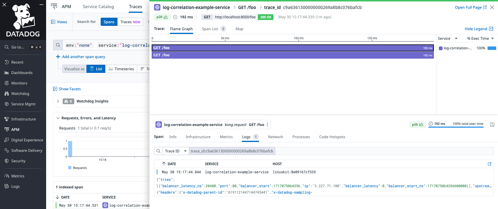
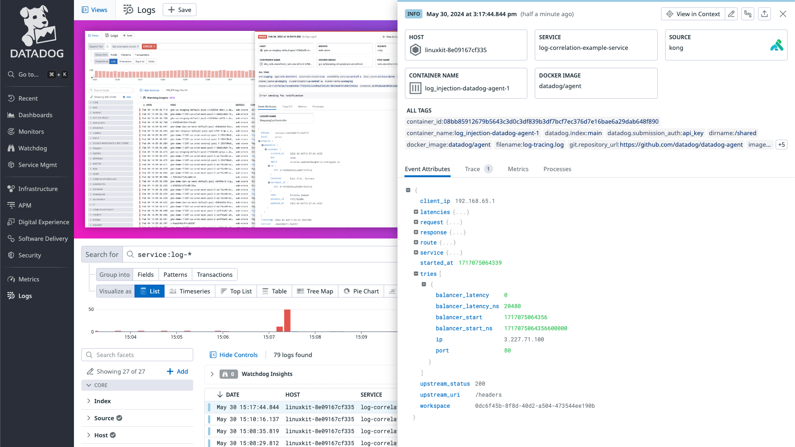

# Log Correlation Example

This is a `docker compose` setup showcases log correlation by creating two services: Datadog Agent and Kong Gateway.

The Kong Gateway is configured to generate and send distributed traces to Datadog, and the [file-config](https://docs.konghq.com/hub/kong-inc/file-log/)
plugin to generate logs that will also be sent to Datadog. The entire configuration is located in [kong.yaml](./kong.yaml).

To run this example, you will need a valid Datadog API key and Docker installed.

### How to run the example

1. Start the services using Docker Compose with you Datadog API key:

```shell
DD_API_KEY=<KEY> docker compose up
```

2. Grant the `kong-dbless` service permission to create the log file in the shared volume:
```
docker compose exece kong-dbless chown -R kong /shared
```

3. Send a request to Kong to generate traffic and a trace:
```shell
curl http://localhost:8000/foo
{
  "headers": {
    "Accept": "*/*",
    "Host": "httpbin.org",
    "Traceparent": "00-c9a6361300000000269a8b8c076bafcb-55eb48277a5d69e1-01",
    "Tracestate": "dd=p:55eb48277a5d69e1;s:1;t.tid:c9a6361300000000;t.dm:-0",
    "User-Agent": "curl/8.6.0",
    "X-Amzn-Trace-Id": "Root=1-66587c78-12932e884e34a78e68008bc4",
    "X-Datadog-Parent-Id": "6191121447144745441",
    "X-Datadog-Sampling-Priority": "1",
    "X-Datadog-Tags": "_dd.p.tid=c9a6361300000000,_dd.p.dm=-0",
    "X-Datadog-Trace-Id": "2781689153390882763",
    "X-Forwarded-Host": "localhost",
    "X-Forwarded-Path": "/foo",
    "X-Forwarded-Prefix": "/foo"
  }
}
```

The trace should be reported in your Datadog account:


Additionally, the log will be available, with the ability to pivot between trace and log views:


